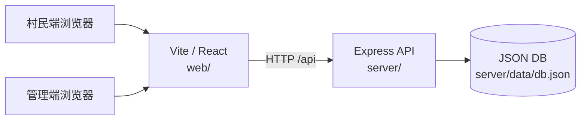

# AI 村小二

**「有问题，问村小二」** — 您的 AI 乡村生活助手

以对话为统一入口的未来乡村便民服务应用：村民用打字 / 语音 / 附件描述需求，AI 识别意图后完成咨询、导引与结构化工单；村委通过轻量管理后台处理工单、维护村务与知识库。

| 资源 | 链接 |
|------|------|
| 在线演示 | https://ai-cunxiaoer.onrender.com |
| 源码仓库 | https://github.com/deemojiang/ai-cunxiaoer |
| 原型地址 | [原型交互](docs/未来乡村AI版原型.html) |

---

## 目录结构

```
ai-cunxiaoer/
├── package.json              # npm workspaces 根脚本（dev / build / start）
├── package-lock.json
├── render.yaml               # Render Blueprint 部署配置
├── .node-version
├── README.md                 # 本说明
├── docs/                     # 产品需求、原型、技术预算与演示文稿
│   ├── 未来乡村AI版-便民服务需求清单.md
│   ├── 未来乡村AI版-技术框架与成本预算.html
│   ├── 未来乡村AI版原型.html  # 原型交互
│   └── AI村小二-产品演示-3.pptx
├── scripts/                  # 截图、PPT、冒烟测试等辅助脚本
│   ├── capture_screenshots.py
│   ├── generate_flowcharts.py
│   ├── generate_ppt.py
│   ├── beautify_ppt_from_template.py
│   ├── render_readme_html.js
│   ├── smoke-test.mjs
│   └── push-and-deploy.md
├── web/                      # 前端（Vite + React）
│   ├── index.html
│   ├── package.json
│   ├── vite.config.ts
│   ├── tsconfig.json
│   ├── public/docs/          # 应用内需求摘要
│   └── src/
│       ├── api/              # API 客户端
│       ├── engine/           # 意图 / 场景 / 天气等对话引擎
│       ├── pages/user/       # 村民端（ChatPage / MyPage）
│       ├── pages/admin/      # 管理后台页面
│       ├── styles/
│       ├── App.tsx
│       └── main.tsx
└── server/                   # 后端（Express）
    ├── package.json
    ├── tsconfig.json
    ├── data/db.json          # JSON 持久化
    └── src/                  # API 与数据访问（index.ts / db.ts）
```

---

## 主要文档说明

| 文档 | 说明 |
|------|------|
| [便民服务需求清单](docs/未来乡村AI版-便民服务需求清单.md) | **唯一需求文档**：AI 村小二便民服务（十二场景、六步流程、工单、后台与分期）+ 附录九场景功能域梳理 |
| [技术框架与成本预算](docs/未来乡村AI版-技术框架与成本预算.html) | 技术选型、架构思路与成本预算（浏览器打开） |
| [原型交互](docs/未来乡村AI版原型.html) | AI 村小二对话办事交互原型（浏览器打开） |
| [产品演示文稿](docs/AI村小二-产品演示-3.pptx) | 产品演示 PPT |

---

## 应用功能

### 村民端

| 模块 | 说明 |
|------|------|
| 首页 | 两排服务卡片 +「更多」、示例提问气泡；支持打字 / 语音模拟 / 附件上传 |
| 十二场景 | 反映问题、设施报修、卖农产品、政策咨询、礼堂预约、医疗挂号、村务公开、技能咨询、健康咨询、找活干、老年订餐、邻里互助 |
| 六步办事 | 识别 → 确认 → 采集 → 摘要 → 生单 → 反馈 |
| 通用问答 | 天气、知识库检索、联网搜索摘要（非办事类即问即答） |
| 我的 | 工单分类筛选、详情进度时间线、「问 AI 查进度」 |

### 管理后台

| 模块 | 路径 | 说明 |
|------|------|------|
| 登录 | `/admin/login` | 管理员鉴权 |
| 概览 | `/admin` | 后台首页 |
| 工单 | `/admin/orders` | 受理 / 完成工单 |
| 村务公开 | `/admin/village` | 村概况、班子、网格、村规维护 |
| 服务配置 | `/admin/services` | 服务开关与首页展示项 |
| 知识库 | `/admin/knowledge` | 政策 / FAQ 等知识条目 CRUD |

默认管理员账号：`admin` / `admin123`

---

## 系统架构

前后端分离开发、生产同域托管：Vite 构建的 React 静态资源由 Express 提供；业务数据持久化在 JSON 文件。



| 层级 | 技术 | 说明 |
|------|------|------|
| 前端 | React 18 + React Router + Vite 6 | 村民对话页、我的、管理后台 |
| 对话引擎 | `web/src/engine/` | 意图识别、十二场景流程、天气等（演示逻辑） |
| 后端 | Express + TypeScript | REST API、静态资源托管、健康检查 |
| 数据 | `server/data/db.json` | 工单、服务配置、村务、知识库、管理员 |

生产环境由服务端托管 `web/dist`，默认端口 `3001`（可用环境变量 `PORT` 覆盖）。

---

## 本地开发

环境要求：Node.js ≥ 18（推荐 20）。

```bash
npm install
npm run dev
```

`npm run dev` 会同时启动 API（约 `3001`）与 Vite 前端（约 `5173`）。

| 入口 | 本地地址 |
|------|----------|
| 村民端 | http://127.0.0.1:5173 |
| 管理后台 | http://127.0.0.1:5173/admin/login |
| API | http://127.0.0.1:3001 |
| 健康检查 | http://127.0.0.1:3001/api/health |

---

## 生产构建与部署

### 本地生产构建

```bash
npm run build
npm start
```

构建后由 `server` 托管前端静态资源；监听 `PORT`（默认 `3001`）。

### Render 部署

仓库已提供 [render.yaml](render.yaml)：

| 项 | 值 |
|----|-----|
| 类型 | Web Service（Node） |
| Build | `npm install --include=dev && npm run build` |
| Start | `npm start` |
| Health Check | `/api/health` |
| 区域 / 套餐 | Singapore / Free（见 Blueprint） |

**一键部署：**

1. 用 GitHub 登录 [Render](https://render.com)
2. **New** → **Blueprint**，选择仓库 `deemojiang/ai-cunxiaoer`（读取根目录 `render.yaml`）
3. 等待 Build / Deploy 完成
4. 打开公网地址，例如：https://ai-cunxiaoer.onrender.com

也可 **New** → **Web Service** 手动填写上述 Build / Start 命令。

| 线上入口 | 路径 |
|----------|------|
| 村民端 | `/` |
| 管理后台 | `/admin/login` |
| 健康检查 | `/api/health` |

> **说明**：Render 免费套餐约 15 分钟无访问会休眠，再次打开需等待冷启动；免费实例磁盘为临时存储，重新部署后演示数据会按种子数据重置。
